# Triply API Assessment – Test Report

## A. Test Cases Executed

### Authentication

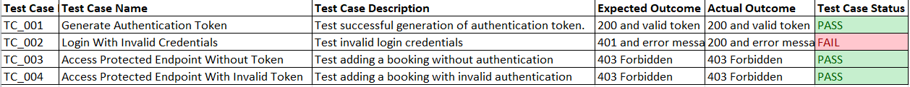

### Booking CRUD

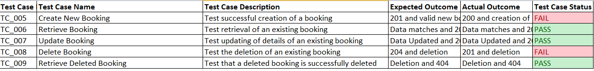

### Error Scenarios

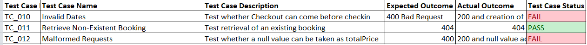

---

## B. Screenshots

1. Token generation – valid and invalid 
   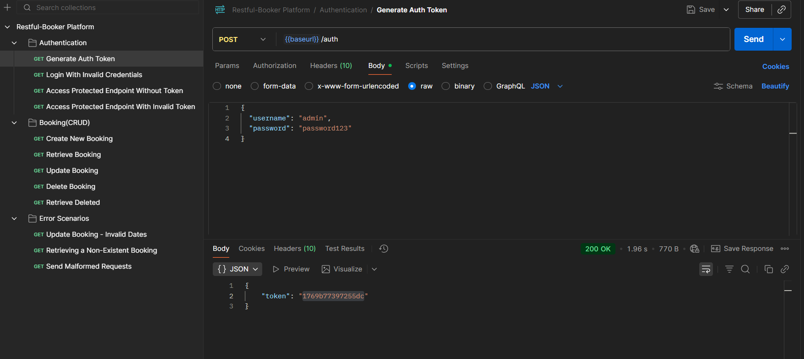
   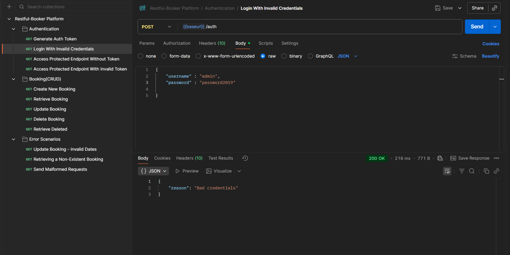

2. Create Booking success 
   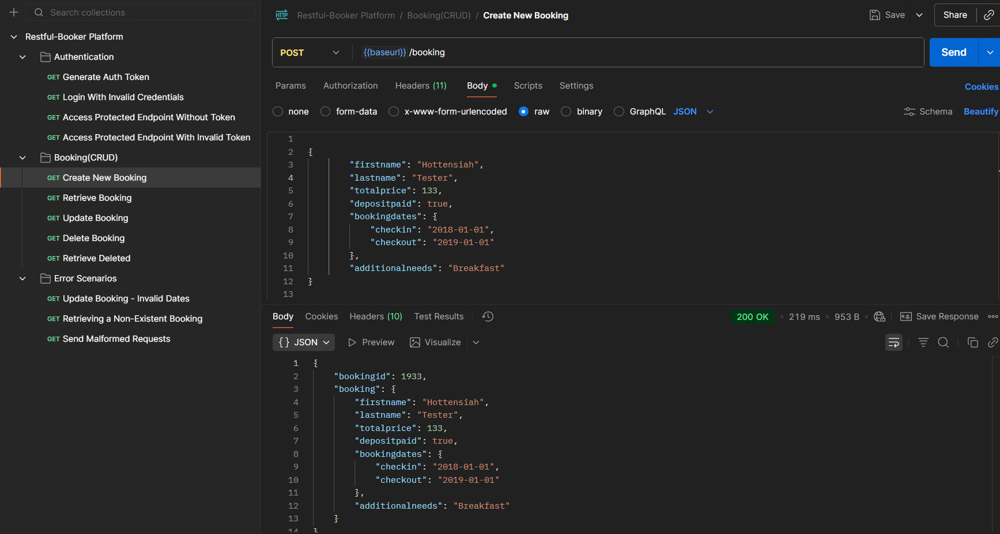

3. Update Booking  
   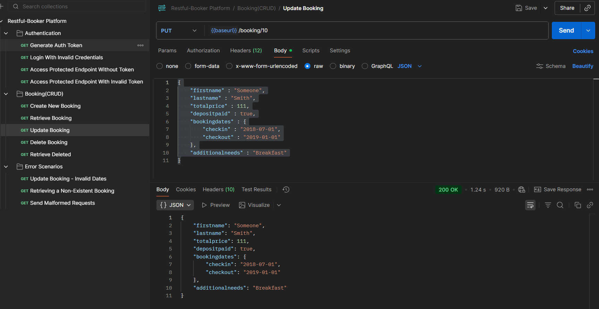

4. Delete Booking  
   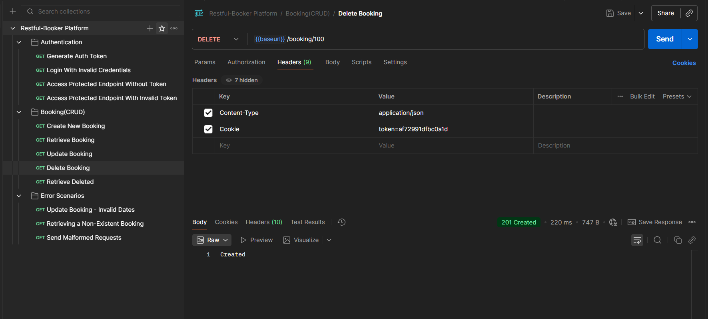

5. Error Scenarios
   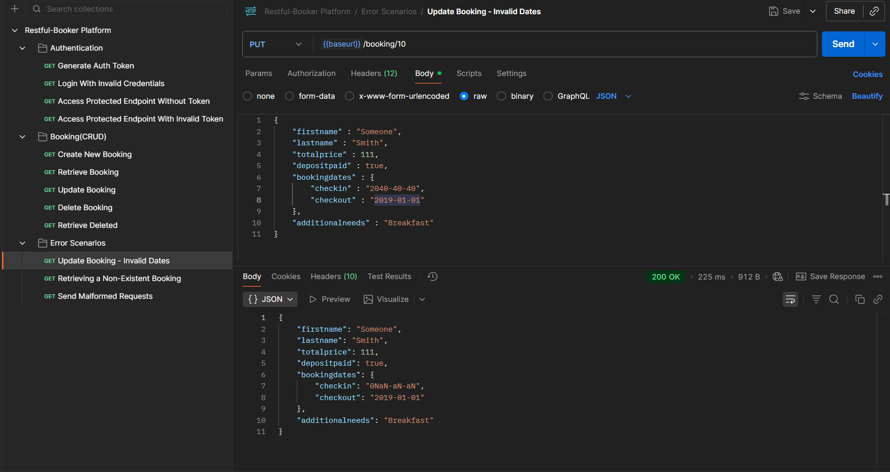
   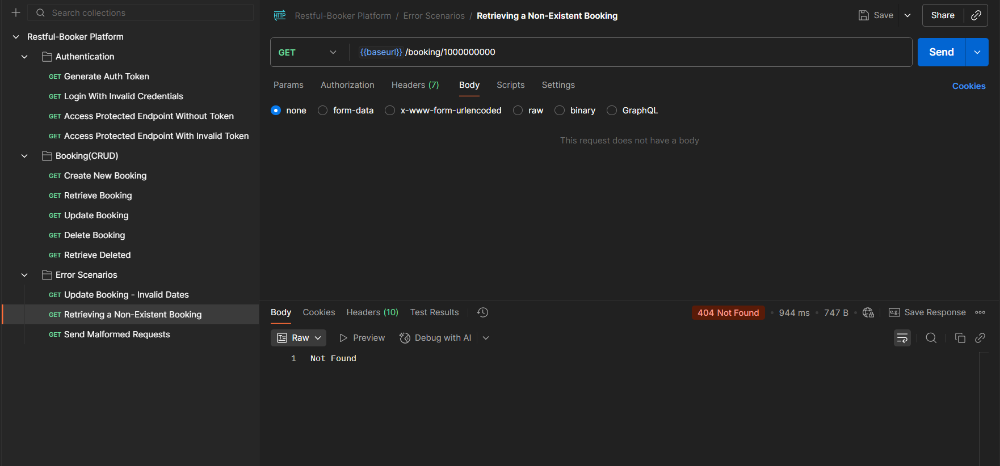
   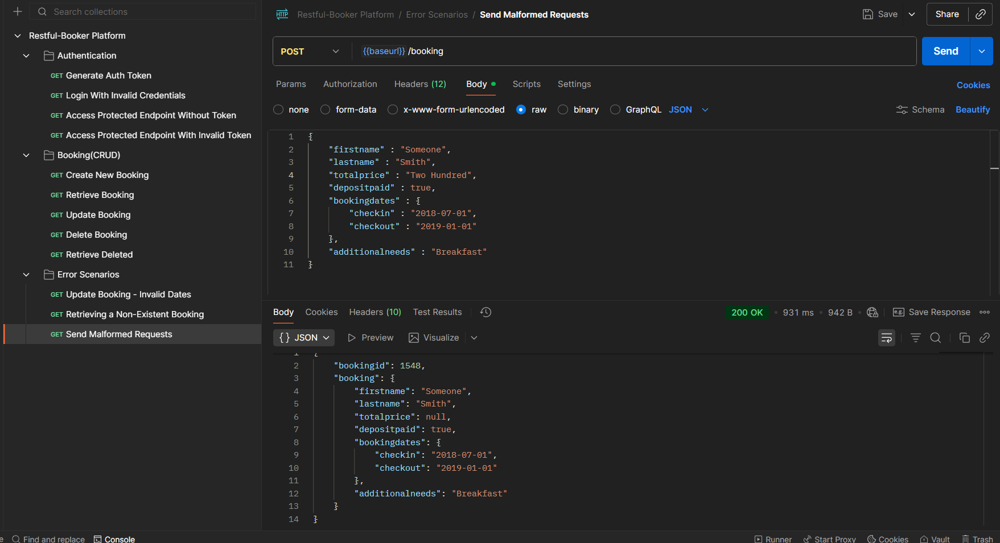

---

## C. Bugs or Issues Identified

1. **Invalid Login returns 200 instead of 401**  
   - Input: wrong password  
   - Expected: 401 Unauthorized  
   - Actual: 200 OK and error message  

2. **Invalid Dates allowed**  
   - Input: check-in after check-out  
   - Expected: 400 Bad Request  
   - Actual: 200 OK and Booking created  

3. **Malformed data type accepts null data**  
   - Input: Update booking with a string as totalPrice instead of a number   
   - Expected: 400 Bad Request 
   - Actual: 200 ok and booking is updated

3. **Deletion of a Booking returns 201 Created** 
   - Action: Delete existing booking  
   - Expected: 204 and deleted booking 
   - Actual: 201 Created and deleted booking

---

**Prepared by:** Hottensiah Nyanjui  
**Date:** 18 February, 2026
